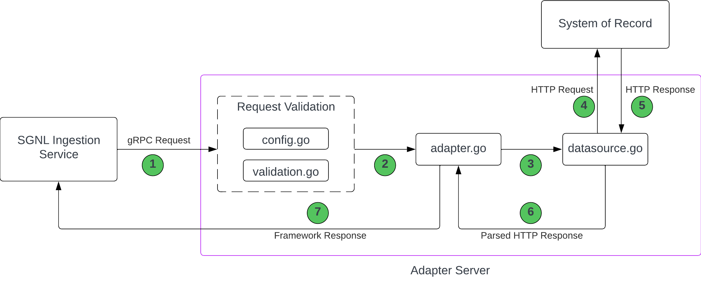

# SGNL Ingestion Adapter Template

The SGNL Ingestion Adapter Template is the starting point for creating a new SGNL Ingestion Adapter.

## Prerequisites

- A basic understanding of the Golang programming language.
- An understanding of the [gRPC](https://grpc.io/) framework and [protocol buffers](https://protobuf.dev/).

## Background Information

### Terminology

**Adapter** - A simple gRPC server that queries an external API and parses the response into a format suitable for the SGNL ingestion service. More information on adapters can be found [TODO].

**SGNL ingestion service** - One of SGNL's core microservices which is responsible for ingesting external data into SGNL's graph database.

**System of Record (SoR)** - An external system that provides data to be ingested into SGNL, typically via an API. For example, a CRM tool like Salesforce or HubSpot.

**Entity** - A SGNL term to represent a type of data within an SoR. An entity typically maps to a single API resource. For example, the IdentityNow Account entity is retrieved from the `/accounts` endpoint.

### What is an adapter?

The adapter is a gRPC server which has two main responsibilities:

1. Making requests to a System of Record (SoR) to retrieve data.
2. Transforming the response from the SoR into a format that can be consumed by the SGNL ingestion service.

The adapter server is **stateless**. It simply acts as a proxy to send requests to SoRs and parse the responses. The adapter uses SGNL's [adapter-framework](https://github.com/SGNL-ai/adapter-framework) under the hood.

Requests to the adapter server invoke the `GetPage` method.

TODO: Add auth information.

## Writing an Adapter

### 1. Getting Started

1. Clone this repository.

1. Update the names of `github.com/sgnl-ai/adapter-template/*` Golang packages in all files to match your new repository's name (e.g. `github.com/your-org/your-repo`):

   ```
   sed -e 's,^module github\.com/sgnl-ai/adapter-template,github.com/your-org/your-repo,' -i go.mod
   ```

   ```
   find pkg/ -type f -name '*.go' | xargs -n 1 sed -n -e 's,github\.com/sgnl-ai/adapter-template,github.com/your-org/your-repo,p' -i
   ```

1. Modify the adapter implementation in package `pkg/adapter` to query your datasource. All the code that must be modified is identified with `SCAFFOLDING` comments.

1. Create an `ADAPTER_TOKENS` file which contains the tokens used to authenticate requests to the adapter server.

   ```
   ["<token1>", "<token2>", ...]
   ```

1. If you don't need to build a Docker image, you can directly run the adapter server. Set the `AUTH_TOKENS_PATH` environment variable to the path of the `ADAPTER_TOKENS` file. Then run `go run cmd/adapter/main.go`. Otherwise, proceed to the next step.

1. Build the Docker image with the `adapter` command.
   ```
   docker build -t adapter:latest .
   ```
   **WARNING:** The image will contain the `ADAPTER_TOKENS` file. **Do not push** this image to a public registry.
1. Run the adapter server as a Docker container.
   ```
   docker run --rm -it -e AUTH_TOKENS_PATH=/path/to/file adapter:latest
   ```

### 2. Research the System of Record

This can be done simultaneously with code development, however it's important to understand the SoR before writing any code.

For each of the entities (i.e. API resources) that must be retrieved from the SoR, take note of the following:

#### Entity Endpoints

The endpoints to query the entity. For example, for a Jira User entity

```bash
https://your-domain.atlassian.net/rest/api/3/users/search # full URL
/rest/api/3/users/search # endpoint
```

Different entities will have different endpoints, and the format may not necessarily be consistent across entities.

#### Response Schemas

The response schemas for each entity. For example, an entity response may look like

```jsonc
{
  "accountId": "5b10a2844c20165700ede21g", // String
  "accountType": "atlassian", // String
  "displayName": "Admin", // String
  "emailAddress": "test@gmail.com", // String
  "active": true, // Bool
  "lastUpdated": "2021-08-06T18:00:00.000Z" // Date
}
```

Each of these JSON fields has a respective type. For example, `accountId` is a string, `active` is a boolean, etc. These must be noted because the adapter needs to know how to parse the response (and consequently the type of each field).

The format of any `date` types can also be noted, e.g. RFC3339.

The adapter supports the following types: https://github.com/SGNL-ai/adapter-framework/blob/f6ad1c42cd34e37be8d4ba800309b5fb858040e1/api/adapter/v1/adapter.proto#L136-L157.

#### Authentication

The required authentication method for connecting to the SoR API. The following types are currently supported by SGNL:

- Basic Auth
- Bearer Token
- OAuth2 (Client Credentials Flow)

Basic Auth credentials and Bearer tokens are passed directly to the adapter in a `GetPage` request.

OAuth flows are performed by the ingestion service which then will pass a token to the adapter for use in constructing requests to the SoR.

#### Authorization

Ensure that the credentials being passed to the adapter have proper authorization to access the entities that need to be retrieved. For example, this may require setting the `scope` of an OAuth2 token.

#### API Restrictions

The request restrictions for each entity. For example,

- **Page size limits.** For paginated APIs, this is the maximum number of results that can be returned in a single request.
- **Filters.** Responses can be filtered to return a subset of objects or fields. These are features of the SoR API which can be leveraged by the adapter server, if needed.
- **Results Ordered.** Are the results of the response ordered by some field? If so, take note of the field. Ordered results provides an optimization, but is not required.

**WARNING:**

Do not assume the results are ordered unless the API explicitly states that they are. An incorrect assumption will cause data to be synced into SGNL incorrectly.

A gRPC request to the adapter server contains the above information. The adapter server uses this information to construct an appropriate request to the SoR.

### 3. Understanding this Template

A simplified flow chart of an incoming gRPC request to the adapter server is shown below:



1. A gRPC request which follows the [adapter Protobuf schema](https://github.com/SGNL-ai/adapter-framework/blob/f2cafb0d963b54c350350967906ce59776d720a1/api/adapter/v1/adapter.proto) is sent by the ingestion service to the adapter server. For testing, you can use Postman to send a gRPC request instead.

2. The gRPC request is validated by `config.go` and `validation.go` and sent to `adapter.go`.

`config.go`

Here, you can specify additional configuration options for the adapter. For example, the API version to use, etc.

https://github.com/SGNL-ai/adapter-template/blob/6fc51e38bb5cb48deecbecbaedfa44c202661709/pkg/adapter/config.go#L22-L45

`validation.go`

Here, you can specify additional validation rules for the gRPC request. For example, the maximum page size, the protocol, the authorization format, etc. `validation.go` also calls the `Validate` method in `config.go`, so any rules specified in `config.go` will also be applied.

https://github.com/SGNL-ai/adapter-template/blob/7fdf875997030e428911d1a3800ca1072906afc8/pkg/adapter/validation.go

3. The gRPC request is further parsed in `adapter.go`, where it is converted into a [`Request` struct](https://github.com/SGNL-ai/adapter-template/blob/7fdf875997030e428911d1a3800ca1072906afc8/pkg/adapter/client.go#L37-L58). The `Request` struct contains all the information needed to construct a request to the SoR. Additionally, `adapter.go` is responsible for:

- Constructing the request to the SoR, including any parsing of page cursors and request parameters.
- Converting the response from the SoR into `framework.Objects`, which is the format expected by the ingestion service. Any options for parsing (e.g. the format of date fields) should be specified here as well.

In general, this file should be kept lean. It should serve as a top level caller to other functions such as validation or making the request to the SoR.

4. The prepared `Request` struct is received by `datasource.go` and it uses this information to send an HTTP request to the SoR.

`datasource.go`

This is where the bulk of the code to actually make the HTTP request, parse the response, and handle pagination should be written.

https://github.com/SGNL-ai/adapter-template/blob/7fdf875997030e428911d1a3800ca1072906afc8/pkg/adapter/datasource.go#L89-L152

5.

### 4.

### 5. Local Testing
